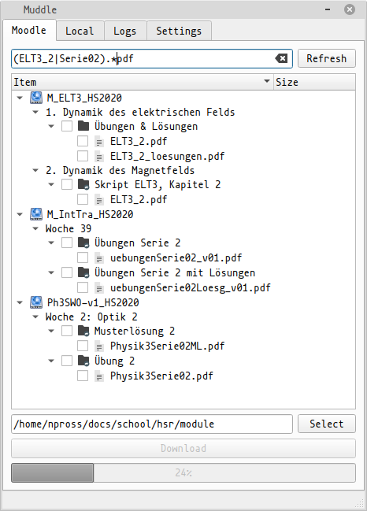
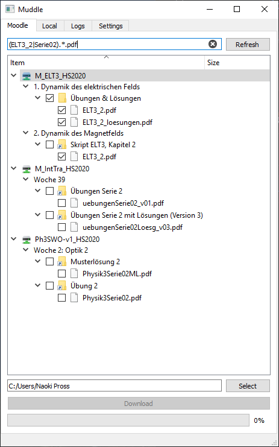

# Muddle (Work in progress!)
A desktop Moodle client, because the web interface is painfully slow if you quickly need to grab a file.

<table><tr>
	<td></td>
	<td></td>
</tr></table>

## Configuration
On Linux, copy `doc/muddle.ini.example` to `~/.config/muddle/muddle.ini` and add a token; on Windows the file should be put in `%APPDATA%\muddle`; and on MacOS in `~/Library/ch.0hm.muddle`.
On other platforms for which there is no specific path implemented yet, so it will look for a file `muddle.ini` in the same folder as the executable.

## Development
This is written in Python 3 + PyQt and the dependencies are managed with 
[Poetry](https://python-poetry.org/docs/#installation).
The code is a bit garbage, as I hacked it together in one morning, though I've tried to clean it up a bit.

### Linux / MacOS
Check that you have Python >= 3.5, install 
[Poetry](https://python-poetry.org/docs/#installation)
and then:
```bash
$ git clone https://github.com/NaoPross/Muddle.git
$ cd Muddle
$ poetry install
$ poetry run python muddle --gui
```

### Windows
1. Install [Python](https://www.python.org), and in the installer enable **Add Python to the path**.
2. Clone this repository
3. Navigate to the project directory using Explorer, then Shift + Right Click and *Open Powershell Window here*
4. In the Powershell you can now start working with
```powershell
PS> poetry install
PS> poetry run python muddle --gui
```

### Coding style
Use pycodestyle (PEP8) except where Qt bindings are used (`gui.py`). To check use
```
$ poetry run pycodestyle --show-source --ignore=E501 muddle/__main__.py muddle/moodle.py muddle/paths.py
```

### Compilation / Release
<!-- TODO: fix this, because it doesn't work (poetry bug, will be fixed by poetry bundle) -->
To create an executable you need PyInstaller, you can get it with
```bash
poetry shell
```
On Linux / MacOS:
```bash
(poetry) $ pyinstaller --onefile --name muddle --specpath build --add-data "muddle/muddle.ui:muddle/muddle.ui" muddle
```
On Windows (the difference is `;`):
```powershell
(poetry) > pyinstaller --onefile --name muddle --specpath build --add-data "muddle/muddle.ui;muddle/muddle.ui" muddle
```
The computer will think for a while, and then once its done there will be a single executable `dist/muddle`.
