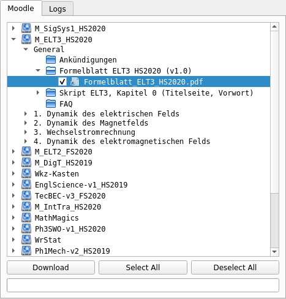

# Muddle (Work in progress!)
A desktop Moodle client, because the web interface is painfully slow if you quickly need to grab a file.



## Configuration
On linux, copy `muddle.ini.sample` to `~/.config/muddle/muddle.ini` and add a token.
On other platforms there is no specific path implemented yet, so it will look for a file `muddle.ini` in the same folder as the executable.

## Development
This is written in Python 3 + PyQt. VirtualEnv is probably the most comfortable way to work.
The code is a bit garbage, as I hacked it toghether in one morning, though I've tried to clean it up a bit.

### Linux / MacOS
If you don't know how to set up a venv, type in you terminal (while in the project directory):
```bash
$ python3 -m venv venv
$ source ./venv/bin/activate
(venv) $ pip3 install -r requirements.txt
(venv) $ ./muddle -v --gui
```

### Windows

1. Install (Python)[python.org], and in the installer enable **Add Python to the path**.
2. Navigate to the project directory using Explorer, then Shift + Right Click and *Open Powershell Window here*
3. In the Powershell you can now create a VirtualEnv by typing
```powershell
PS> python -m venv venv
PS> .\venv\Scripts\activate
(venv) PS> pip3 install -r requirements.txt
(venv) PS> python muddle.py -v --gui
```

#### VirtualEnv says `running scripts is diabled on this System`
If when activating the virtualenv using powershell you get something like this
```
.\venv\Scripts\activate : File C:\Users\NaoPross\Documents\Code\Muddle\venv\Scripts\Activate.ps1 cannot be loaded
because running scripts is disabled on this system. For more information, see about_Execution_Policies at
https:/go.microsoft.com/fwlink/?LinkID=135170.
At line:1 char:1
+ .\venv\Scripts\activate
+ ~~~~~~~~~~~~~~~~~~~~~~~
    + CategoryInfo          : SecurityError: (:) [], PSSecurityException
    + FullyQualifiedErrorId : UnauthorizedAccess
```
You need to change your ExecutionPolicy, to do that you need to type the following to allow for scripts to be executed
```powershell
PS> Get-ExecutionPolicy -List                            # see the current settings
PS> Set-ExecutionPolicy RemoteSigned -Scope CurrentUser  # allow your user to run script
```

### Coding style

Use PEP8 except where Qt bindings are used (`gui.py`). To check use
```
$ pep8 --show-source --ignore=E501 moodle.py muddle.py <more files...>
```

### Compilation / Release
To create an executable you need PyInstaller, you can get it with
```
$ pip3 install pyinstaller
```
And then run
```
$ pyinstaller --onefile muddle
```
The computer will think for a while, and then once its done there will be a single executable `dist/muddle`.
